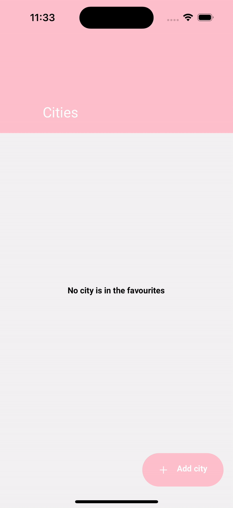

# Project made by Deborah De Biasio - Weather App

      
</duv>   

## Weather Information Management
This documentation outlines the functionality of the application's weather information management system, allowing users to maintain a list of cities and retrieve both current and historical weather data.

Users have the capability to manage a list of cities within the application, enabling them to access real-time and historical weather information for those locations.
Clicking the button "Add city" users can add or remove city names. 

All the temperatures are in Celsius.

#

## Technical Information

Using Node version 18.17.1

The list of cities is taken from https://bulk.openweathermap.org/sample/